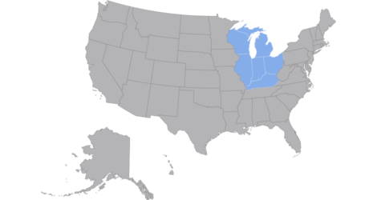

The Centers for Disease Control and Prevention's investment in Advanced molecular detection (AMD) is harnessing advancements in next-generation genomic sequencing combined with high-performance computing and epidemiology to study infectious diseases and improve public health response.

### [CDC AMD Investments](https://www.cdc.gov/advanced-molecular-detection/php/investments/index.html)
 
 

## About Us
{:.mt-lg-0}

### Wisconsin State Laboratory of Hygiene

#### Senior Genomics and Data Scientist

##### [Kelsey Florek, PhD MPH](https://k-florek.net/)

With a lifelong fascination for infectious diseases and a passion for public health, Dr. Kelsey Florek has dedicated her career to unraveling complex biological questions. Dr. Florek is a Senior Genomics and Data Scientist at the Wisconsin State Laboratory and works towards enhancing the application of data in public health.

#### Bioinformatics Regional Resource

##### Christopher Jossart, MS  

Christopher Jossart, also known as C.J., is a data scientist in the Communicable Disease Division at the Wisconsin State Laboratory of Hygiene. He holds an MPH from the Yale School of Public Health and completed a year-long bioinformatics fellowship with the Association of Public Health Laboratories at WSLH. C.J. specializes in bioinformatic workflow development, onboarding and validating new pipelines, and submitting data to public databases

#### Bioinformatics Training Lead

##### Abigail C Shockey, PhD (they/them)  

Dr. Abigail Shockey is a data scientist in the Wisconsin State Laboratory of Hygiene's Communicable Disease Division. They received their postdoctoral degree in Microbiology at the University of Wisconsin-Madison, where their doctoral work focused on the genomics of bacteria at different evolutionary scales. They completed a bioinformatics fellowship from the Association of Public Health Laboratories at WSLH. Dr. Shockey’s work is focused on outbreak investigation using genomic data, bioinformatic workflow development, and bioinformatic training development. They are also a certified Carpentries instructor, and they develop Carpentries style workshops designed to teach practical computational skills to scientists.

### Michigan Department of Health & Human Services

#### Genomics Technical Director

##### Heather Blankenship, PhD

Dr. Heather Blankenship serves as the Genomics Technical Director at the Michigan Department of Health and Human Services (MDHHS), Bureau of Laboratories. She obtained her bachelor's from George Mason University where she specialized in Biotechnology and Molecular Genetics before completing her PhD at Michigan State University in Microbiology and Molecular Genetics specializing in Genomic Epidemiology. In her role as a senior manager at MDHHS, she provides oversight for next generation sequencing processes, bioinformatics development, genomic epidemiology analyses, and integration of these efforts into public health action. She currently serves on multiple national and international workgroups and committees to provide support and insight on workforce development, quality best practices, and utilization of genomic data. Over the course of her career, she has been cross-trained in microbiology, bioinformatics, and epidemiology, and is passionate about leveraging her cross-training to connect these diverse fields. 

#### Genomic Analysis Unit Manager/Interim Genomic Epidemiology Training Lead

##### Arianna Miles-Jay, PhD MPH  

Dr. Arianna Miles-Jay is the Genomic Analysis Unit Manager at the Michigan Department of Health and Human Services Bureau of Laboratories, where she leads a team of bioinformaticians and genomic epidemiologists that process and analyze pathogen genomic data to support infectious disease prevention and response efforts in Michigan. She earned her MPH and PhD in Epidemiology at The University of Washington followed by a postdoctoral fellowship focused on the genomic epidemiology of healthcare-associated infections at The University of Michigan. Broadly speaking, Arianna is interested in expanding the implementation of genomic epidemiology within state and local public health through developing sustainable and flexible systems to analyze pathogen sequence data, as well as through teaching the current and future workforce about the power of genomic epidemiology to improve public health. 

#### Bioinformatics Regional Resource

##### John Chodkowski, PhD  

John Chodkowski is a Bioinformatics Specialist within the Genomics Analysis Unit at the Michigan Department of Health & Human Services (MDHHS). He received his doctoral degree in Microbiology and Molecular Genetics at Michigan State University. His current work focuses on bioinformatic pipeline development within the nextflow framework, particularly with respect to viruses and TB, and serving as a co-bioinformatics regional resource.

#### Bioinformatics and Laboratory Training Lead

##### Macy E. Pell, PhD (she/her)  

Macy is the AMD Training Lead and Analyst for the Genomics Section at the Michigan Department of Health and Human Services – Bureau of Laboratories. She obtained her PhD in Microbiology and Molecular Genetics from Michigan State University where she received extensive training in genomic sequencing, analysis, and interpretation of infectious diseases. As a seasoned science communicator, Macy focuses on curating and facilitating training resources and events for the public health workforce affiliated with advanced molecular detection efforts (i.e., sequencing, bioinformatics, and genomic epidemiology) in the Midwest region.

## Upcoming Events
{:.mt-lg-0}

